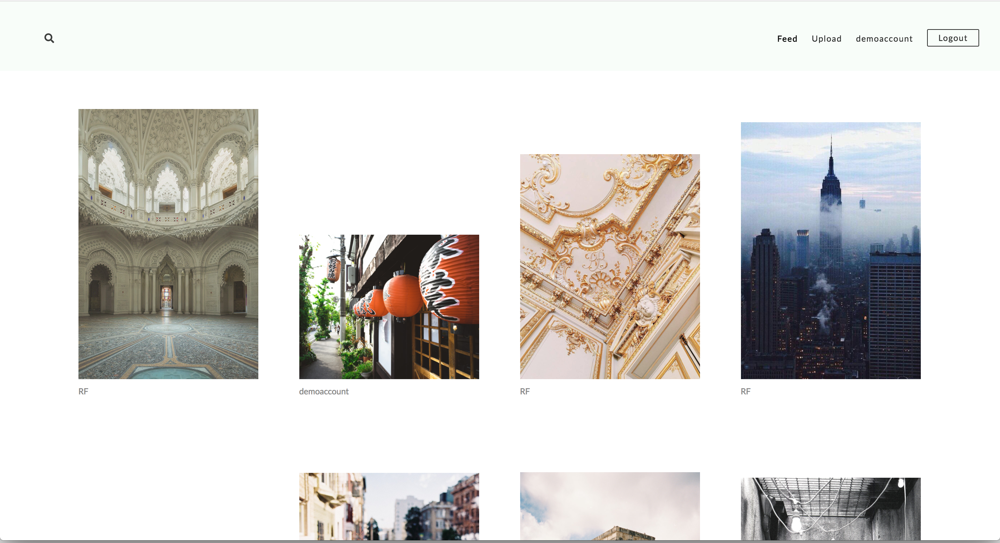
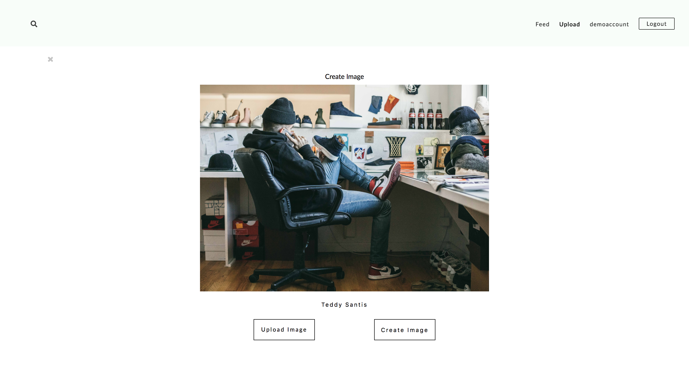
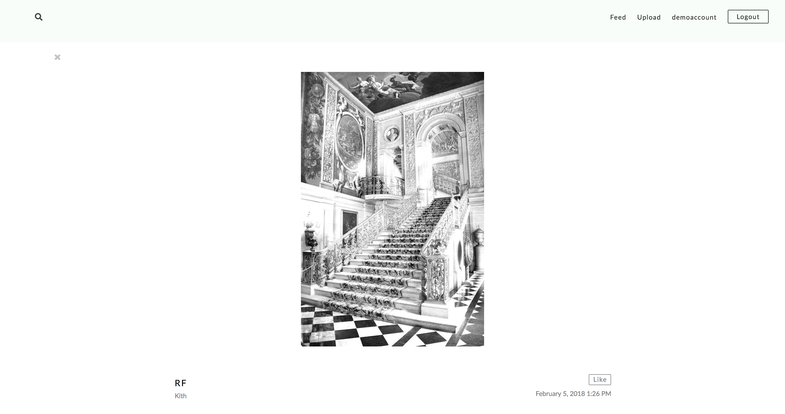

<div>
<div align="">
  
</div>

<div>

  <a href="https://visualmovement.herokuapp.com/#/">Visual Movement Live Demo</a>

<br>
<br>

Visual Movement is a full-stack single-page application inspired by VSCO's creative platform. Visual Movement uses Rails/PostgreSQL backend with React.js and Redux on the frontend
<br>
<br>

<div align="left">
  <h1 font-weight="bold">Features</h1>
    <li> User Authentication with secure frontend and backend </li>
    <li> User photo upload using AWS + Paperclip </li>
    <li> User ability to follow and unfollow other profiles </li>
    <li> User ability to like and unlike photos </li>
    <li> Feed page to display images </li>
    <li> User search functionality </li>
  <div>
<br>

<div>
  <h1>User Feed</h1>
    <p>
      Block feed showing 4 individual images on each line with the user profile links underneath each. Feed generated based on users followed
    </p>
    <div align="">
      
</div>

<br>
<div>
  <h1>Upload Photo</h1>
    <p>
      Users can upload individual photos for their profile feed with and input for photo caption
    </p>
    <div align="">
    

</div>

<br>
<div align="left">
  <h1>User Profile</h1>
    <li>Users can view other profiles and see their images within a Masonry layout.</li>
    <li>Current User can select to follow profile </li>
    <li>Current User can view other user's liked photos </li>
  <div align="">
    

<br>

```
<Masonry className="profile-images-container">
  {
    this.props.images.reverse().map(image => (
    <li key={image.id} className="profile-images">
      <Link to={`/images/${image.id}`}>
        
      </Link>
    </li>
    ))
  }
</Masonry>

```
<br>

<p align="left">
  Achieved Masonry blocks using Masonry for React while displaying as block.
</p>


```
let followButton;
if (this.props.currentUser.id === parseInt(this.props.match.params.userId)){
  followButton = null;
}
else if (this.props.follows === false){
  followButton = (
    <button
      className="follow-button"
      onClick={this.handleFollow}>
      Follow
    </button>
  );
} else if (this.props.follows === true){
  followButton = (
    <button
      onClick={this.handleFollow}
      className="unfollow-button">
      Unfollow
    </button>
  );
} else {
  followButton = null;
}

```

<p align="left">
  Set up Follow function by sending back a boolean from jbuilder whether the current user was following the user profile page. The functionality would depend on the case of the boolean.
</p>


<br>

<div align="left">
<h1>Photo View</h1>
  <li>Users can click images to view larger version including its description and date of creation</li>
  <li>Users can like photos from this view</li>
  <div align="">
    
</div>
</div>
